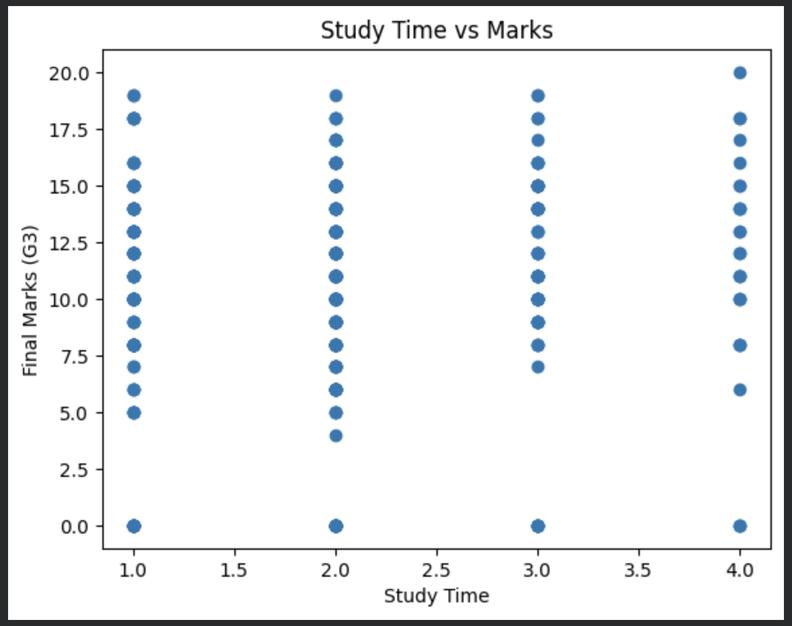

# Student Performance Prediction (Machine Learning)

## 📌 Project Overview
This project predicts student final marks (G3) using machine learning techniques based on factors like study time, absences, and previous scores.

## 🛠️ Technologies Used
- Python
- Pandas
- NumPy
- Matplotlib
- Scikit-learn

## 📊 Models Used
- Linear Regression
- Decision Tree Regressor

## 📈 Results
- Linear Regression MAE: 1.3
- Decision Tree MAE: 1.6

## 🔍 Key Insights
- Study time has a positive impact on student performance
- Previous scores (G1, G2) strongly influence final marks

- ## 🔄 Workflow
1. Data Collection
2. Data Preprocessing
3. Feature Selection
4. Train-Test Split
5. Model Training
6. Prediction
7. Evaluation (MAE)

## 📂 Dataset
The dataset contains student academic information such as:
- Study Time
- Absences
- Previous Grades (G1, G2)
- Final Grade (G3)

## ⭐ Highlights
- Built complete ML pipeline from scratch
- Compared multiple models
- Achieved MAE of 1.3

## 📸 Output

Source: UCI Machine Learning Repository

## 🚀 Conclusion
Linear Regression performed better for this dataset with lower error.

---
